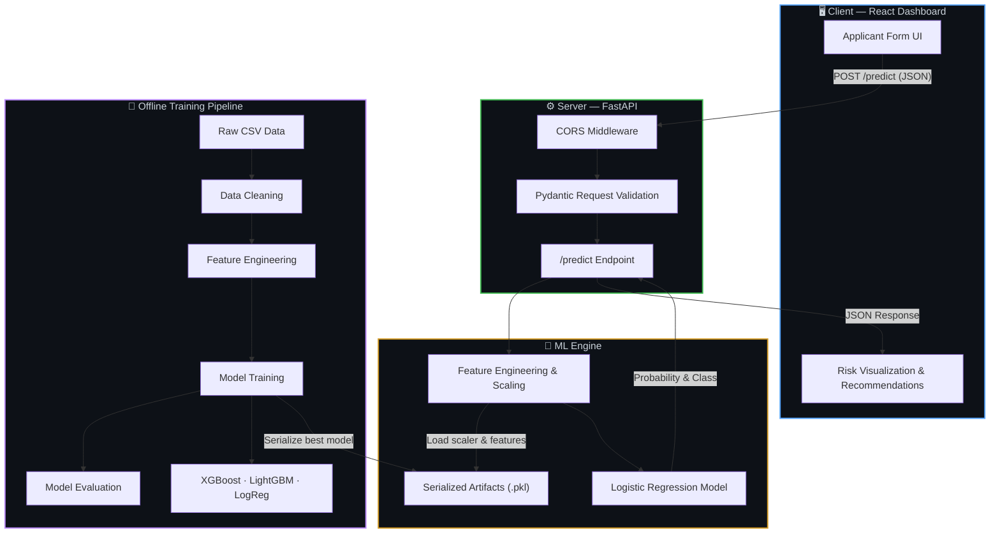
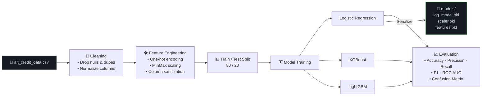

<p align="center">
  
  
  
  
  
</p>

# 🧠 Credeasy — AltCreditScoreAI

> **AI-powered alternative credit scoring for the 1.4 billion people worldwide excluded from formal finance.**

Credeasy is a full-stack machine-learning application that predicts loan default risk using **alternative (non-traditional) financial data**. It provides lenders with an explainable, real-time risk assessment dashboard and gives applicants **actionable recommendations** to improve their creditworthiness.

---

## 📑 Table of Contents

- [System Architecture](#-system-architecture)
- [Data & ML Pipeline](#-data--ml-pipeline)
- [Features](#-features)
- [Tech Stack](#-tech-stack)
- [Getting Started](#-getting-started)
- [API Reference](#-api-reference)
- [Testing](#-testing)
- [License](#-license)

---

## 🏛️ System Architecture



### Component Overview

| Component | Responsibility |
|---|---|
| **React Dashboard** | Collects applicant data, visualizes risk scores, threshold gauges, and personalized recommendations |
| **FastAPI Server** | Validates incoming requests via Pydantic schemas, serves predictions over a REST API with CORS support |
| **ML Engine** | Loads serialized model artifacts at startup, applies feature engineering & scaling, returns probability of default |
| **Training Pipeline** | End-to-end offline pipeline: data loading → cleaning → feature engineering → multi-model training → evaluation |

---

## 🔬 Data & ML Pipeline



> **Why Logistic Regression for production?** While XGBoost and LightGBM may achieve marginally higher accuracy, Logistic Regression was chosen for the live API because of its **interpretability** — a critical requirement for financial decision-making where explainability to regulators and applicants is paramount.

---

## ✨ Features

| Feature | Description |
|---|---|
| 🎯 **Real-Time Risk Prediction** | Submit applicant data and receive instant default probability scores via a live ML model |
| 💡 **Explainable AI & Actionable Insights** | Rule-based recommendation engine provides personalized tips (e.g., *"Build Your Savings"*, *"Shorten Loan Term"*) |
| 📊 **Visual Risk Threshold** | Color-coded gauge visualizes where the applicant falls on the Safe → Review → Reject spectrum |
| 🔄 **Multi-Model Comparison** | Training pipeline benchmarks Logistic Regression, XGBoost, and LightGBM side-by-side |
| ✅ **Comprehensive Evaluation** | ROC curves, Precision-Recall curves, confusion matrices, and classification reports |
| 🌙 **Premium Dark Mode UI** | Modern glassmorphism dashboard with micro-animations and responsive design |
| 🧪 **Unit Tested** | pytest suite covering data cleaning, feature engineering, model training, and evaluation |

---

## 🛠️ Tech Stack

### Frontend
| Technology | Purpose |
|---|---|
| React 18 | Component-based UI framework |
| Vite | Lightning-fast dev server and bundler |
| Vanilla CSS | Custom responsive dark-mode design system |

### Backend
| Technology | Purpose |
|---|---|
| FastAPI | High-performance async Python API framework |
| Pydantic | Request/response data validation and serialization |
| Uvicorn | ASGI server for production-grade serving |

### Machine Learning
| Technology | Purpose |
|---|---|
| Scikit-Learn | Logistic Regression, preprocessing, evaluation metrics |
| XGBoost | Gradient-boosted tree model (comparison) |
| LightGBM | Light gradient-boosted tree model (comparison) |
| Pandas | Data manipulation and pipeline orchestration |
| Matplotlib | Evaluation visualization (ROC, PR curves, confusion matrices) |
| Joblib | Model and artifact serialization |

### DevOps & Quality
| Technology | Purpose |
|---|---|
| pytest | Unit testing framework |
| Loguru | Structured, colorized logging |
| Flake8 / Bandit | Linting and security analysis |

---

## ⚙️ Getting Started

### Prerequisites

| Requirement | Version |
|---|---|
| Python | 3.10+ |
| Node.js | 18+ |
| pip | Latest |
| C++ Build Tools | Required on Windows for some ML dependencies |

### 1️⃣ Clone the Repository

```bash
git clone https://github.com/dasouvik122005/Credeasy.git
cd Credeasy
```

### 2️⃣ Backend Setup (Python / FastAPI)

```bash
# Create and activate a virtual environment
python -m venv venv

# Windows
venv\Scripts\activate

# macOS / Linux
source venv/bin/activate

# Install all dependencies
pip install -r requirements.txt
```

#### Train the ML Models (Optional — pre-trained artifacts included)

```bash
python run_pipeline.py
```

#### Start the API Server

```bash
uvicorn src.api.main:app --reload --port 8000
```

The API will be live at **`http://localhost:8000`** — interactive docs at **`http://localhost:8000/docs`**.

### 3️⃣ Frontend Setup (React / Vite)

Open a **new terminal** window:

```bash
cd dashboard
npm install
npm run dev
```

The dashboard will be live at **`http://localhost:5173`**.

---

## 📡 API Reference

### `POST /predict`

Predicts the probability of loan default for a given applicant.

#### Request Body

```json
{
  "account_check_status": "no checking account",
  "duration_in_month": 24,
  "credit_history": "existing credits paid back duly till now",
  "purpose": "car (new)",
  "credit_amount": 5000,
  "savings": "unknown/ no savings account",
  "present_emp_since": "1 <= ... < 4 years",
  "installment_as_income_perc": 2,
  "personal_status_sex": "male : single"
}
```

#### Response

```json
{
  "probability_of_default": 0.73,
  "prediction_class": 1
}
```

| Field | Type | Description |
|---|---|---|
| `probability_of_default` | `float` | Probability (0–1) that the applicant will default |
| `prediction_class` | `int` | `0` = No Default (Approve), `1` = Default (Reject/Review) |

---

## 🧪 Testing

Run the full test suite with:

```bash
pytest tests/ -v
```

| Test Module | Coverage |
|---|---|
| `test_cleaning.py` | Data cleaning (null removal, deduplication, column normalization) |
| `test_features.py` | Feature engineering (encoding, scaling, column sanitization) |
| `test_train_model.py` | Model training pipeline execution |
| `test_evaluate.py` | Evaluation metric computation |

---

## 📄 License

This project is licensed under the **MIT License** — see the [LICENSE](LICENSE) file for details.

---

<p align="center">
  Built with ❤️ for <strong>HyperFUSION 2026</strong> · Theme: Fin-Tech
</p>
